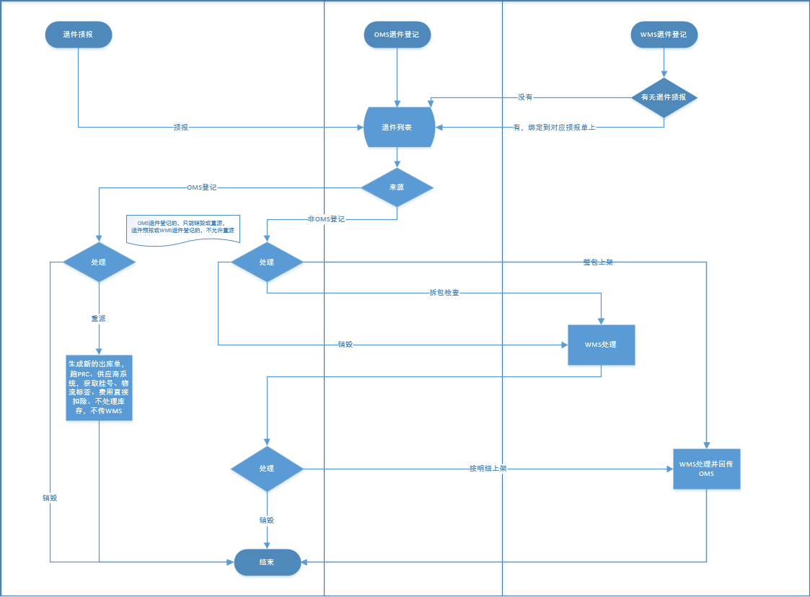
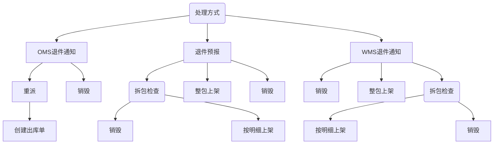

### 退件流程

> 1. -- 客户端-退件预报
> 2. 新建数据 按处理状态通知wms仓库进行处理 如果是拆包检查 wms会把sku信息回调；拆包上架需要填写新sku ，进行上架 拆包检查等其余条件都需要wms回调
> > - 推送WMS （com.szmsd.returnex.controller.ReturnExpressOpenController.expectedCreate）
> > - WMS接收到货，回调OMS （com.szmsd.returnex.controller.ReturnExpressOpenController.saveArrivalInfoFormWms）
> >    -销毁
> > ### 处理
>
